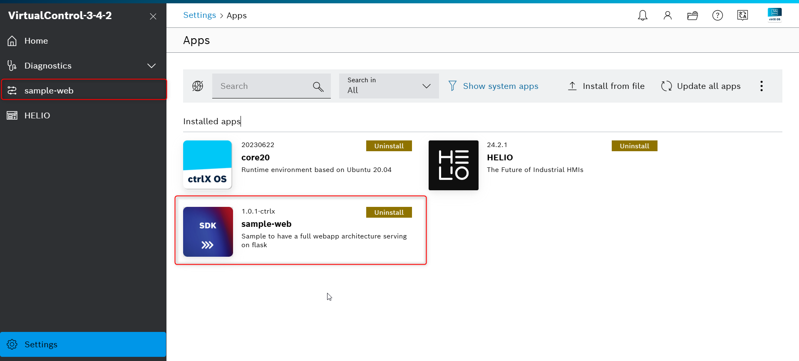
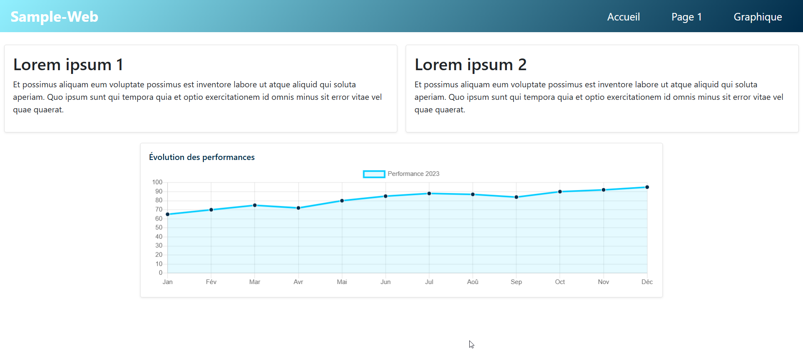
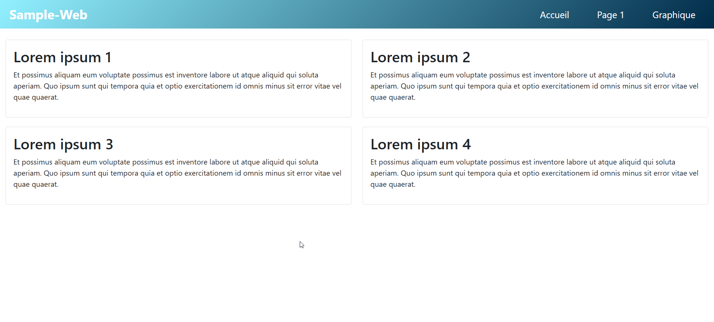
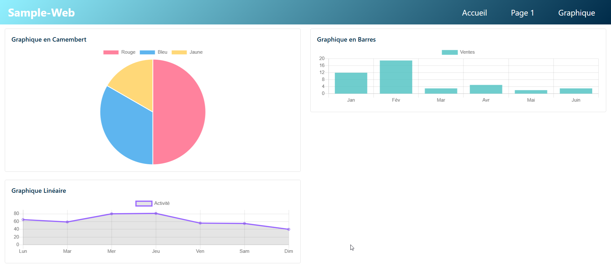

# sample-web

Ce projet sert comme base pour le développement d'une UI Web sur le CtrlX OS. Il montre une architecture possible et compatible une fois snappé dans le ctrlX Core. 

## Rendu 






## Librairies

Le framework web utilisé est Flask. Dans cet exemple j'ai intégré deux librairies : 
- [Chart.js](https://www.chartjs.org/)
- [Bootstrap](https://getbootstrap.com/)

Très utilisés, je pense qu'elles permettront de réaliser 99% des dashboards

## Structure web

```
├── app.py
├── static
│   ├── bootstrap-5.0.2-dist
│   │   ├── css
│   │   └── js
│   ├── css
│   │   └── styles.css
│   └── js
│       ├── Chart.min.js
│       ├── barChart.js
│       ├── homeLineChart.js
│       ├── lineChart.js
│       └── pieChart.js
└── templates
    ├── base.html
    ├── graphique.html
    ├── index.html
    ├── navbar.html
    └── page1.html
```

## Structure Snap

```
├── Flask
├── configs
│   └── package-assets
│       └── sample-flask-webapp.package-manifest.json
├── requirements.txt
├── sample-web_1.0.1-ctrlx_amd64.snap
├── sample-web_1.0.1-ctrlx_arm64.snap
├── shscripts
│   ├── desktop-launch
│   ├── info.sh
│   └── runserver.wrapper
├── snap
│   ├── gui
│   │   └── icon.png
│   └── hooks
│       ├── install
│       └── remove
├── snapcraft.yaml