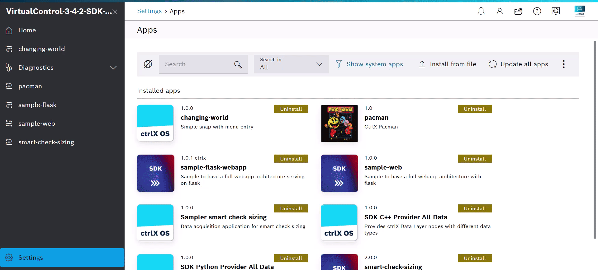

# sample-web-Extended
Cette branche est une amélioration de la branche principale. Dedans on va y retrouver de nouvelle fonctionalitées : Base de données/Iframe/Datalayer
## Overview



## Cet exemple vous fait rêver et vous voulez l'installer ?
### version snapcraft 
- 8.9.2

```bash
git clone https://github.com/Felix-73/CTRLX-SDK-APP-Sample-Web.git
pip install -r requirements.txt
```
Pour debuger localement :
(ne pas oublier d'installer le venv)
```bash
cd Flask
flask run
```
Avant de snapper :
```bash
chmod -R 755 *
```
Pour un virtuel et X7: 
```bash
./build-snap-amd64.sh  
```
Pour CtrlX3
```bash
./build-snap-armd64.sh
